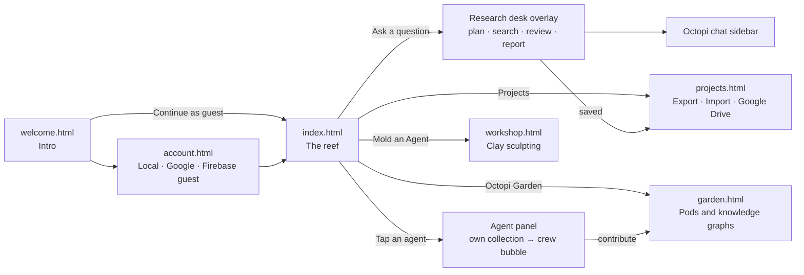
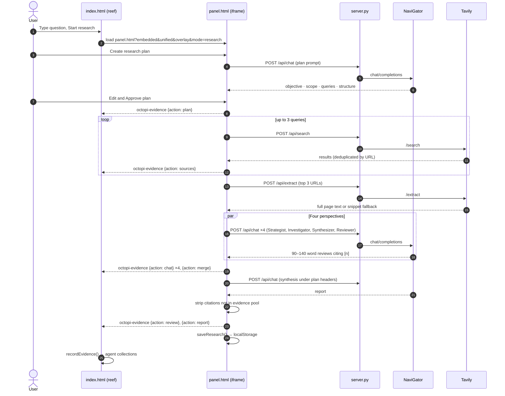
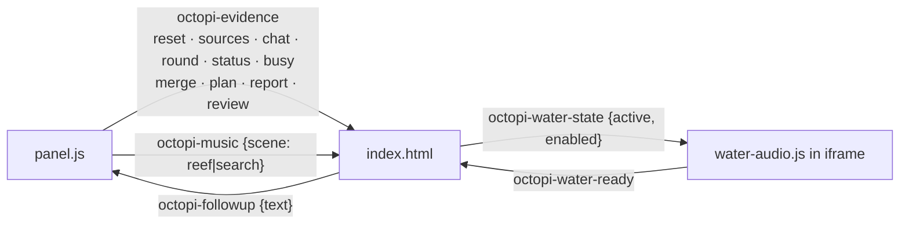
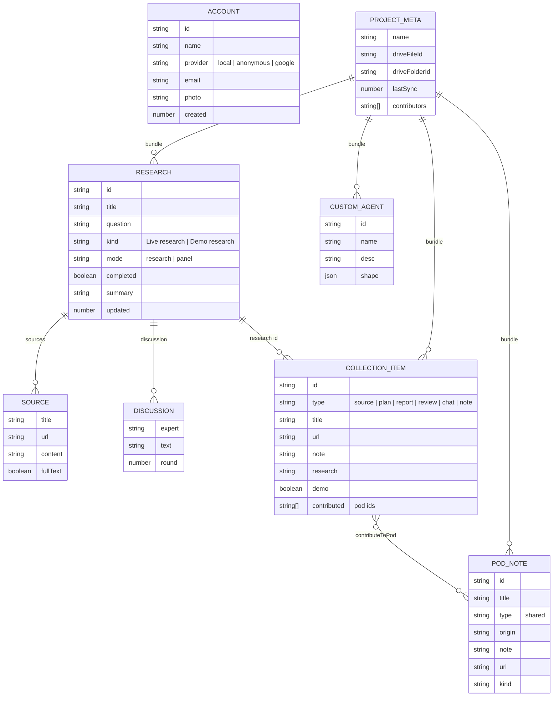
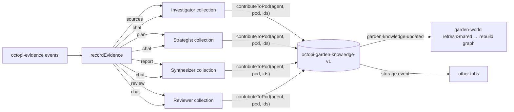
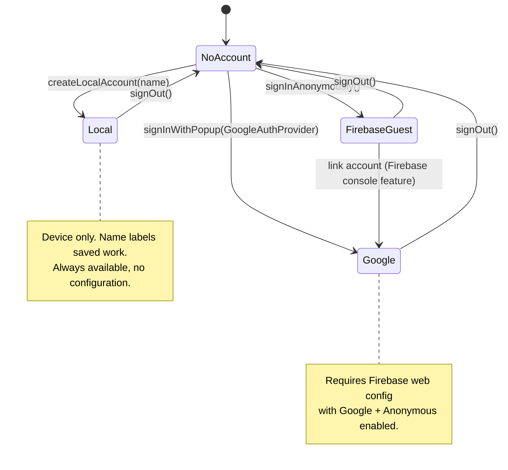
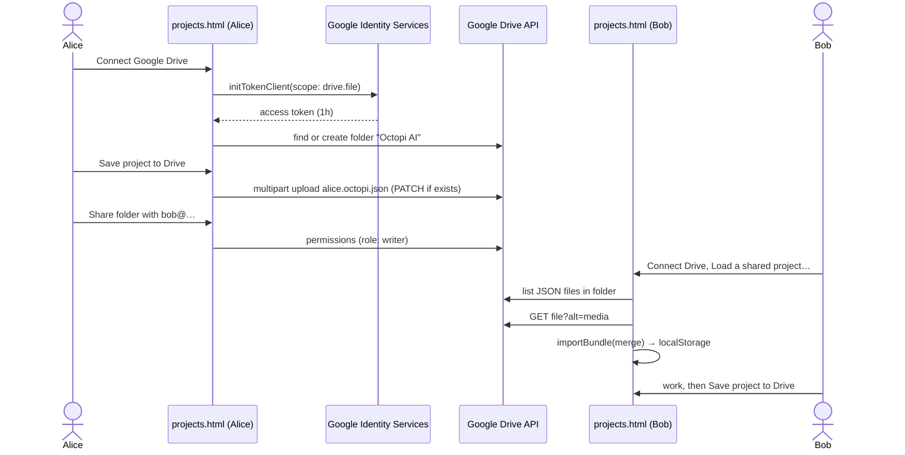
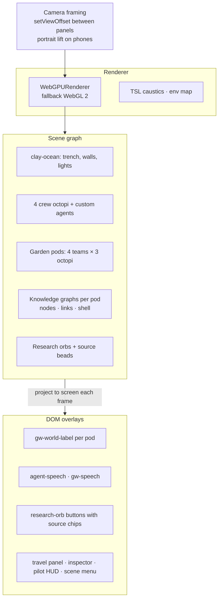
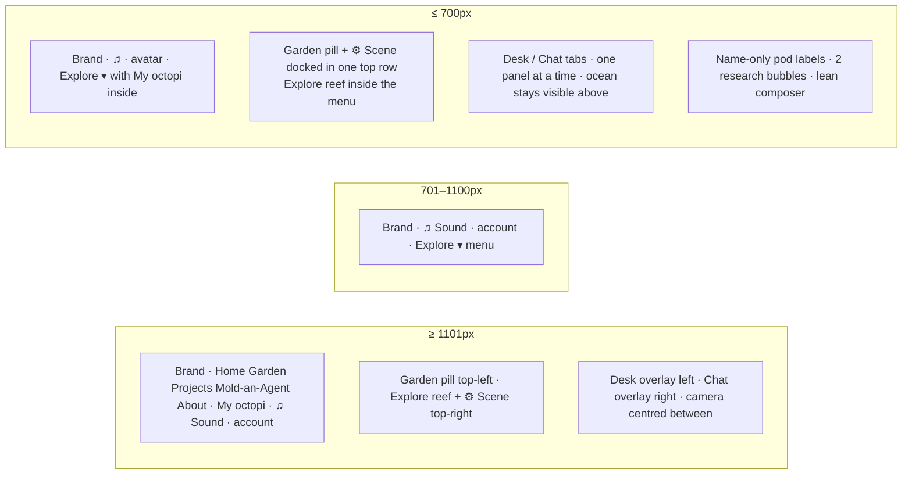

# Octopi AI · Research reef

**Octopi 3D AI Research** — an interactive, browser-based research environment where four clay octopus agents (Strategist, Investigator, Synthesizer, Reviewer) plan, gather evidence, write and review a cited report while you watch, steer and decide. Their findings grow into knowledge bubbles that can be shared with a garden of collaborating pods, exported as project files, or synced to Google Drive.

Repository: <https://github.com/jayrosen-design/octopi>

- **Zero build step.** Static HTML/CSS/ES modules plus a 100-line Python bridge. No npm, no bundler.
- **Demo first, live when connected.** Everything runs as an explicitly labelled demo. Add a UF NaviGator key (chat models + Kokoro speech) and a Tavily key (web search) for real research.
- **Local-first.** Accounts, research, agent collections and garden bubbles live in `localStorage`; optional Firebase auth and Google Drive sync layer on top.
- **WebGPU.** Three.js `WebGPURenderer` with TSL caustics, falling back to WebGL 2.

---

## Table of contents

1. [Quick start](#quick-start)
2. [The experience](#the-experience)
3. [Architecture](#architecture)
4. [Pages](#pages)
5. [Module reference](#module-reference)
6. [Research pipeline](#research-pipeline)
7. [Window messaging protocol](#window-messaging-protocol)
8. [Data model and storage](#data-model-and-storage)
9. [Agent collections and pod bubbles](#agent-collections-and-pod-bubbles)
10. [Accounts and authentication](#accounts-and-authentication)
11. [Project files and Google Drive](#project-files-and-google-drive)
12. [Local server API](#local-server-api)
13. [3D scene](#3d-scene)
14. [Audio](#audio)
15. [Navigation and responsive layout](#navigation-and-responsive-layout)
16. [Configuration](#configuration)
17. [Security and privacy](#security-and-privacy)
18. [What is live and what is illustrative](#what-is-live-and-what-is-illustrative)
19. [Verification](#verification)
20. [Repository layout](#repository-layout)

---

## Quick start

```bash
git clone https://github.com/jayrosen-design/octopi.git
cd octopi
python server.py          # Python 3, no packages required
# open http://127.0.0.1:8765/
```

The server serves the static files and acts as a fixed-destination bridge to the providers. It is required for live research and speech; the demo, the 3D scenes and the local storage features work from any static host.

Optional environment keys (used when the browser does not supply its own):

| Variable | Purpose |
| --- | --- |
| `UF_NAVIGATOR_API_KEY` or `NAVIGATOR_TOOLKIT_API_KEY` | UF NaviGator chat completions, model list and Kokoro speech |
| `TAVILY_API_KEY` | Tavily web search and page extraction |

Internet access is needed for the providers, the pinned Three.js modules (`unpkg.com/three@0.184.0`), fonts, and — when configured — the Firebase and Google Identity SDKs.

---

## The experience



1. **Welcome** explains the crew. First-time visitors to `index.html` are redirected here until they either sign in or continue as a guest.
2. **Account** creates a local device account (name only) or signs in with Google / as an anonymous Firebase guest when a Firebase config is present.
3. **The reef** (`index.html`) is the home: the four-agent crew in the foreground with their own data bubble, the Garden pods behind them, and the composer with **Deep Research**, **Experts** and **Documents** modes.
4. Starting a question opens the **research desk** as an in-scene overlay (left) and the **octopi chat** (right). The camera re-frames the open water between them.
5. Each agent keeps an **own collection**; one tap contributes it to the crew's shared bubble, which grows live in the Garden.
6. **Projects** gathers everything as a single project file for export, import, or Google Drive sharing with collaborators.

---

## Architecture

```mermaid
flowchart TB
    subgraph Browser["Browser (static ES modules)"]
        direction TB
        subgraph Pages
            IDX[index.html]
            GAR[garden.html]
            WS[workshop.html]
            PNL[panel.html<br/>iframe inside index]
            FLOW[welcome · account · projects · about]
        end
        subgraph Scene["3D scene modules"]
            GW[garden-world.js]
            RR[research-reef.js]
            CA[clay-agent.js · fidelity.js]
            CG[clay-grab.js · clay-tools.js<br/>clay-contacts.js · clay-dynamics.js]
            CO[clay-ocean.js · clay-texture.js]
        end
        subgraph State["Local-first state"]
            RS[research-store.js]
            AC[agent-collections.js]
            AS[agent-store.js]
            PF[project-files.js]
            OA[octopi-account.js]
            OC[octopi-config.js]
            LS[(localStorage)]
        end
        subgraph Shell["Shared shell"]
            NAV[site-navigation.js]
            MUS[music.js · water-audio.js]
            VOICE[navigator-voice.js]
        end
    end
    subgraph Server["server.py (127.0.0.1:8765)"]
        ST[Static files]
        API["/api/* bridge"]
    end
    subgraph Cloud["External services"]
        NAVG[UF NaviGator<br/>chat · models · kokoro]
        TAV[Tavily<br/>search · extract]
        FB[Firebase Auth]
        GD[Google Drive API]
        CDN[unpkg three@0.184]
    end
    IDX --> GW & RR & CA & CG & CO
    IDX <-- postMessage --> PNL
    PNL --> API
    VOICE --> API
    API --> NAVG & TAV
    RS & AC & AS & PF & OA & OC --> LS
    OA -. on demand .-> FB
    PF -. on demand .-> GD
    Scene --> CDN
    NAV --> OA
```



Design principles:

- **No framework, no build.** Every page is a self-contained HTML file importing ES modules. Three.js is loaded through an import map from a pinned CDN version.
- **The panel is an iframe.** `panel.html` owns the research pipeline. The reef embeds it (`?embedded=1&unified=1&overlay=1&mode=…`) and mirrors its events into the scene through `postMessage`. The panel also runs standalone.
- **Local-first state.** Modules under *State* each own one `localStorage` key and publish DOM `CustomEvent`s so any open view re-renders. Cross-tab updates arrive through the `storage` event.
- **Providers are only reached through the bridge.** The browser never calls NaviGator or Tavily directly; `server.py` forwards to fixed hosts and redacts provider error bodies.

---

## Pages

| Page | Role | Key modules |
| --- | --- | --- |
| `welcome.html` | Intro and first-visit gate; "Begin" or "Continue as a guest" | `octopi-account.js` |
| `account.html` | Local account, Google / Firebase guest sign-in, connection settings (Firebase config, Google client ID, Drive folder) | `octopi-account.js`, `octopi-config.js` |
| `index.html` | The reef: crew, Garden pods, composer, research desk overlay, octopi chat, agent panel with collections | almost everything |
| `panel.html` | Research/expert panel workspace (standalone or embedded) | `panel.js`, `panel-layout.js` |
| `garden.html` | Full-size Garden: visit pods, pilot an octopus, knowledge graphs, share notes between pods | `garden.js` → `garden-world.js` |
| `workshop.html` | Clay workshop: sculpt and save a custom agent | `workshop.js` |
| `projects.html` | Project files: stats, saved research, agent collections, pod bubbles, export/import, Drive sync | `project-files.js`, `agent-collections.js` |
| `about.html` | How the pieces fit and what is illustrative | — |
| `landing.html` | Legacy redirect to `index.html` | — |

---

## Module reference

### Scene

| Module | Responsibility |
| --- | --- |
| `garden-world.js` | Mounts the Garden (pods, octopi, world labels, speech bubbles, knowledge graphs, travel panel, inspector, pilot HUD) either full-page or compact behind the reef. Accepts extra teams (the crew), listens for `garden-knowledge-updated` / `storage` to grow bubbles live. Exposes `expand()`, `releasePilot()`, `report()`. |
| `garden-data.js` | The four authored demo pods, their ideas, dialogue and reference URLs. |
| `research-reef.js` | Research bubbles above the crew: DOM orb per collection, source **chips** inside the orb (favicon or number) mirrored by beads on the sphere, speech bubbles, merge animation. Feeds from `octopi-evidence` messages. |
| `clay-agent.js`, `fidelity.js` | Procedural clay octopus builder, arm animation, tools, TSL caustics and environment. |
| `clay-grab.js` | Picking, dragging and dropping clay objects; the fading control hint. |
| `clay-tools.js`, `clay-contacts.js`, `clay-dynamics.js` | Tool click animations, contact/settling and lightweight spring physics. |
| `clay-ocean.js`, `clay-texture.js` | Trench environment, walls, lights; procedural clay textures. |
| `octopus-control.js` | WASD / arrow / touch-pad piloting of an octopus. |
| `workshop.js` | Sculpting tools, undo, save to `agent-store.js`. |

### State

| Module | Key | Responsibility |
| --- | --- | --- |
| `research-store.js` | `deepsea-research-v1` | Saved research records (max 12), starter collections, `resumeResearch()`, points. |
| `agent-collections.js` | `octopi-agent-collections-v1` | Per-agent items; `recordEvidence()` routes pipeline events to the right agent; `contributeToPod()` writes into the Garden store. |
| `agent-store.js` | `deepsea-clay-agents-v1` | Up to four molded custom agents. |
| `project-files.js` | `octopi-project-meta-v1` | Bundles all keys into one JSON project; merge/replace import; Google Drive folder, save, list, load, share. |
| `octopi-account.js` | `octopi-account-v1`, `octopi-intro-seen` | Local account; on-demand Firebase anonymous/Google sign-in; `watchAccount()`. |
| `octopi-config.js` | `octopi-config-v1` | Firebase config, Google client ID, Drive folder name; defaults in file, overrides in storage. |
| Garden (in `garden-world.js`) | `octopi-garden-knowledge-v1` | Notes added to each pod's bubble. |

### Shell

| Module | Responsibility |
| --- | --- |
| `site-navigation.js/.css` | Builds the nav on every page: brand, Explore menu (collapsible under 1100px), Sound menu, account chip; first-visit intro gate; page fade transitions; moves page buttons (`gridShow`, `musicToggle`, `mute`, `connect`) into the bar. |
| `music.js` | Scene music with cross-tab ownership handoff (`octopi-audio-owner`). |
| `water-audio.js` | Procedural per-octopus water sounds, six-voice limit, `octopi-fx` setting. |
| `navigator-voice.js` | Kokoro speech through `/api/speech`, Listen buttons, auto-read. |
| `garden-preload.js` | Low-priority background warm-up of Garden resources. |

---

## Research pipeline

`panel.js` implements the Deep Researcher flow. Nothing searches until the plan is approved.



Modes:

| Mode | URL | Rounds | Agents |
| --- | --- | --- | --- |
| Deep Research | `panel.html?mode=research` | plan → 1 evidence review → report | Strategist, Investigator, Synthesizer, Reviewer |
| Experts | `panel.html` | 4 rounds (perspectives, discussion, challenge, refinement) → moderator synthesis | Researcher, School Teacher, Instructional Designer, Education Leader (panel of 1, 2 or 4) |
| Documents | `panel.html` with `panel-doc-method` | editorial co-write methods: Guided, Parallel Review, Pipeline, Roundtable | editorial crew |

Budget: a Deep Research run uses six model calls, up to three searches and one extraction. A live four-round expert panel uses 17 model requests. The **Demo** button runs the same choreography with scripted replies and example sources, clearly labelled.

Citation policy: the synthesizer may only cite `[n]` for gathered sources; the reviewer step replaces any other reference with `[citation unavailable]` and appends a numbered source list. This bounds references to the evidence pool; it is not independent fact-checking.

---

## Window messaging protocol

The reef and the embedded panel talk over `postMessage` with `location.origin` checks on both sides.



Every `octopi-evidence` message carries `session` (research id) and `question`. In the reef:

- `chat | reset | sources | merge` → `research-reef.js` (bubbles, beads, speech).
- all actions → `sceneChat()` (right sidebar: messages, round headings, status, busy state).
- all actions → `agent-collections.recordEvidence()` (sources → Investigator, plan → Strategist, report → Synthesizer, review → Reviewer, chat → the speaking agent).

---

## Data model and storage



`localStorage` keys:

| Key | Owner | Contents |
| --- | --- | --- |
| `octopi-account-v1` | `octopi-account.js` | Current account |
| `octopi-intro-seen` | `octopi-account.js` | Skip the welcome gate |
| `octopi-config-v1` | `octopi-config.js` | Firebase config, Google client ID, Drive folder name |
| `deepsea-research-v1` | `research-store.js` | Up to 12 research records |
| `octopi-agent-collections-v1` | `agent-collections.js` | `{agentId: [items]}` (60 per agent) |
| `octopi-garden-knowledge-v1` | `garden-world.js` / `agent-collections.js` | `{podId: [notes]}` (24 per pod) |
| `deepsea-clay-agents-v1` | `agent-store.js` | Up to 4 molded agents |
| `octopi-project-meta-v1` | `project-files.js` | Project name, Drive ids, contributors |
| `octopi-points` | `research-store.js` | Awarded points |
| `octopi-provider-keys-v1` | `panel.js` | **Opt-in only**: NaviGator/Tavily keys and model |
| `octopi-fx`, `octopi-audio-owner` | audio | Water-sound setting, cross-tab music owner |

`sessionStorage` (per tab): `panel-question`, `panel-resume`, `panel-custom-agent`, `panel-expert-size`, `panel-doc-method`, `panel-home-mode`, `octopi-show-grid`, `deepsea-music`.

Events dispatched on `window` so open views re-render: `octopi-account`, `octopi-config`, `research-updated`, `collections-updated`, `garden-knowledge-updated`, `project-updated`, `drive-connected`.

---

## Agent collections and pod bubbles

Each agent stores what it produced. Items can be contributed to any pod's bubble; the Garden picks the change up immediately.



Entry points:

- **Reef agent panel** — tap an agent → *Own collection* shows the latest items and **Contribute N to crew bubble**.
- **projects.html** — checkbox any items across agents, pick a target pod, **Add to bubble**.
- **Garden share control** — combine one pod's notes into another (demo garden behaviour).

Contributed notes carry `origin: "<Agent>'s collection"`, the original URL when present, and a citation string, so the Garden inspector can show *Open source ↗* and *Copy citation*.

---

## Accounts and authentication



- The Firebase SDK (`firebase-app.js`, `firebase-auth.js` 10.x from `gstatic.com`) is imported **only** when `hasFirebase()` is true, so pages stay fully functional offline or without a project.
- `onAuthStateChanged` mirrors the Firebase user into `octopi-account-v1`; the nav chip and every page react through `watchAccount()`.
- `restoreFirebaseSession()` re-attaches the listener on load so refreshes keep Google/guest sessions.
- The welcome gate in `site-navigation.js` sends first-time visitors who land on `index.html` to `welcome.html` unless an account or `octopi-intro-seen` exists, or the URL carries `workspace`/`agent` parameters.

---

## Project files and Google Drive

A project file is one JSON document (`format: "octopi-project", version: 1`) containing research, molded agents, agent collections, garden bubbles and points, plus author and contributors.



Merge semantics (`importBundle(bundle, 'merge')`): records are unioned by `id`, newer `updated` wins; collections merge per agent; pod notes append unknown ids; contributors are unioned; your project name is kept unless it is still the default. `replace` adopts the file wholesale. Import also works from a downloaded `.octopi.json` without Drive.

Scope is `https://www.googleapis.com/auth/drive.file` — the app can only see files it created. Tokens live in page memory.

---

## Local server API

`server.py` is a `ThreadingHTTPServer` on `127.0.0.1:8765`. It only accepts requests whose `Host`/`Origin` are the local preview, rejects `.py`/`.env`/dot-files, and limits JSON bodies to 180 kB.

| Method | Path | Body | Upstream | Notes |
| --- | --- | --- | --- | --- |
| GET | `/api/status` | — | — | `{navigator: bool, tavily: bool}` — whether server env keys exist |
| POST | `/api/models` | `navigatorKey?` | `GET api.ai.it.ufl.edu/v1/models` | list of chat model ids |
| POST | `/api/search` | `query` (1–4000 chars), `tavilyKey?` | `POST api.tavily.com/search` | 6 results, basic depth, content ≤ 5000 chars |
| POST | `/api/extract` | `urls` (1–3 http/https), `tavilyKey?` | `POST api.tavily.com/extract` | raw content ≤ 12 000 chars each |
| POST | `/api/chat` | `model`, `messages` (1–20), `navigatorKey?` | `POST api.ai.it.ufl.edu/v1/chat/completions` | `max_tokens 1600`, `temperature .5` |
| POST | `/api/speech` | `text` (≤ 4000), `voice`, `speed` (.5–2), `navigatorKey?` | `POST api.ai.it.ufl.edu/v1/audio/speech` | model `kokoro`, MP3 stream ≤ 12 MB |

Errors are normalised: provider HTTP errors → `502` with a generic message, unreachable → `502`, validation → `400`. Provider response bodies are never echoed to the browser.

---

## 3D scene



- **Renderer.** `WebGPURenderer` from `three@0.184.0/build/three.webgpu.js`; `renderMode` in the Scene menu reports *WebGPU reef* or *WebGL 2 reef*.
- **Octopi.** Built procedurally in `clay-agent.js`: mantle pulses, independent arm bends, held tools on alternating arms, facing logic so grouped octopi look at their teammates with a thinking glance. Custom agents from the workshop are added to the crew row.
- **Crew bubble.** The front crew is injected into `garden-world.js` as an extra team (`CREW` in `index.html`) with its own graph (`graphY 5.05`, `shellRadius 1.4`) that also retains saved live research.
- **Research orbs.** One orb per collection above an owner octopus; sources render as chips inside the orb (favicon or index) with matching beads on the sphere so nothing floats loose. A merge collapses beads into the orb.
- **Camera framing.** `frameBetweenPanels()` applies `camera.setViewOffset`: horizontally to centre the water between the desk and the chat on desktop, vertically to lift the crew above the composer on portrait phones.
- **Interaction.** `clay-grab.js` picks octopi, tools, pebbles and coral; empty-water drags orbit. Garden travel buttons and world labels `visit()` a pod; **Take control** pilots an octopus with WASD/arrows or the touch pad; Escape releases.

---

## Audio

- **Music** (`music.js`): reef and search tracks, starts after a permitted interaction, cross-tab handoff through `octopi-audio-owner`.
- **Water sounds** (`water-audio.js`): procedural swishes and bubble tones per octopus with stereo placement, distance attenuation and a six-voice cap; embedded frames follow the parent's state.
- **Speech** (`navigator-voice.js`): NaviGator Kokoro (`af_heart` default) through `/api/speech`; Listen buttons per message, optional auto-read of the selected pod. No browser TTS fallback.

All three live under one **♫ Sound** menu in the nav; the menu collapses to inline when a page has a single control.

---

## Navigation and responsive layout



- `site-navigation.js` builds the bar once per page and applies `aria-current`. Same-origin page changes fade out over 160 ms (`page-leave`) and fade in on arrival (`page-enter`); `prefers-reduced-motion` disables the transitions.
- Phone-specific rules live in `unified-home.css` (`@media (max-width:700px)`), `garden-world.css` (`@media (max-width:800px)`) and `site-navigation.css` (`@media (max-width:800px)`).
- The welcome, account and projects pages share `flow.css`, written mobile-first.

---

## Configuration

`octopi-config.js` holds deployment defaults; `account.html` lets a user paste overrides that are stored in `octopi-config-v1`.

```js
export const DEFAULT_CONFIG = {
  firebase: null,          // {apiKey, authDomain, projectId, appId, …}
  googleClientId: '',      // OAuth 2.0 Web client ID with Drive API enabled
  driveFolderName: 'Octopi AI'
};
```

Firebase: enable **Anonymous** and **Google** under *Authentication → Sign-in method*; add your domain under *Authorized domains* (localhost is included by default).

Google Drive: create a *Web application* OAuth client in Google Cloud, enable the **Google Drive API**, and add your origin (for example `http://127.0.0.1:8765`) to *Authorized JavaScript origins*.

Provider keys: enter them in the research desk's **Connect NaviGator** dialog. They stay in tab memory unless **Remember these keys on this device** is ticked (stored unencrypted in `octopi-provider-keys-v1`; **Clear keys** removes them).

---

## Security and privacy

- The bridge accepts only local `Host`/`Origin`, forwards to fixed provider hosts, never logs, and redacts provider error bodies.
- No keys ship with the app. Browser-supplied keys travel only to `127.0.0.1:8765` and onward to the matching provider; server environment keys are used only when the request omits one.
- Research questions, evidence and speech text are sent to NaviGator/Tavily and may consume provider credits. **Stop** cancels subsequent steps; requests already sent may still finish.
- `postMessage` handlers verify `origin` and `source` on both sides. External source links open with `rel="noopener noreferrer"`; only `http(s)` URLs are rendered as links.
- Drive access is limited to `drive.file`. Firebase and Google SDKs load only when configured.
- All persistent data is in this browser unless the user exports it or syncs to Drive.

---

## What is live and what is illustrative

| Live when connected | Illustrative / authored |
| --- | --- |
| Plan generation, web search, page extraction, perspectives, synthesis, citation bounding | The **Demo** run: scripted replies, three example source cards |
| Kokoro speech | Garden pod conversations, cross-pod introductions, graph *positions* (authored relationships, not embeddings) |
| Saved research, collections, pod contributions, project files, Drive sync | Starter collections in the reef |
| Firebase sign-in when configured | The animated mini-browser (represents activity, not a remote browser) |

AI-generated reports can contain mistakes. Open the sources, check citations and apply judgement before relying on a result.

---

## Verification

Checked in a real browser (desktop widths and 390×844 phone emulation): welcome → account → reef flow, demo research through the overlay with the chat sidebar and camera re-framing, agent collections filling from pipeline events, one-tap contribution growing the crew bubble in the reef and in `garden.html`, project export/merge import, Drive UI in unconfigured state, Scene and Sound menus, and phone docking/compaction of the top bar. `node --check` passes for every module. Backend fixture tests cover routing, missing keys, origin rejection, extraction, chat, Kokoro binary responses and redacted provider errors.

Not verified with credentials: live NaviGator/Tavily runs, Firebase sign-in against a real project, Google Drive round trips with a real client ID. The local server is a single-user preview, not a hosted multi-user service.

---

## Repository layout

```
octopi/
├─ server.py                 Static server + provider bridge
├─ index.html                The reef (home)
├─ welcome.html · account.html · projects.html · about.html · landing.html
├─ panel.html · panel.js · panel.css · panel-layout.js · unified-workspace.css
├─ garden.html · garden.js · garden.css · garden-data.js · garden-world.js · garden-world.css · garden-preload.js
├─ workshop.html · workshop.js · workshop.css
├─ research-reef.js · research-store.js · agent-collections.js · agent-store.js
├─ project-files.js · octopi-account.js · octopi-config.js
├─ site-navigation.js · site-navigation.css · navigation.css · flow.css · home.css · unified-home.css
├─ clay-agent.js · clay-grab.js · clay-tools.js · clay-contacts.js · clay-dynamics.js · clay-ocean.js · clay-texture.js · clay-interaction.css
├─ fidelity.js · octopus-control.js
├─ music.js · water-audio.js · navigator-voice.js
├─ src/assets/personas/      Agent portraits
└─ assets/                   Music and imagery
```

Cache-busting is manual: stylesheet and module URLs carry `?v=` tokens that are bumped when a file changes.

---

Octopi AI is an interactive research prototype built on UF NaviGator. Experimental — AI output may be inaccurate; verify claims and citations.
